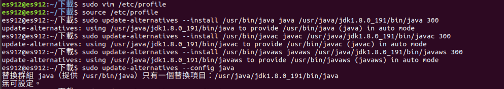
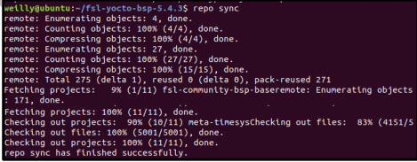
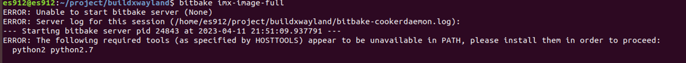
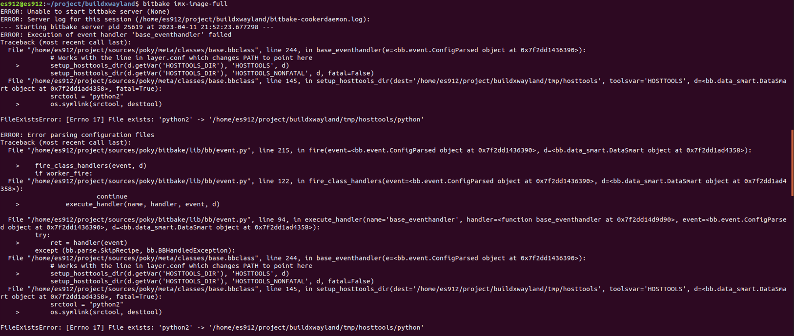
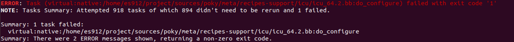

i.MX8QM Yocto BSP環境架設
======

### 安裝octo BSP軟體

+ Ubuntu環境為18.04

```
$ sudo apt-get install gawk wget git-core diffstat unzip texinfo gcc-multilib build-essential chrpath socat cpio 
python python3 python3-pip python3-pexpect xz-utils debianutils iputils-ping python3-git python3-jinja2 
libegl1-mesa libsdl1.2-dev pylint3 xterm curl repo
```


```
$ sudo apt-get upgrade
```

+ 接下來下載jdk-8u191-linux-x64.tar.gz(在上面)，如果要下載別的版本去官網找，需要創建一組帳密才能使用

```
https://www.oracle.com/java/technologies/javase/javase8-archive-downloads.html

```

### 安裝 Java Development Kit 

```
$ sudo mkdir /usr/java
```

+ 接下來要對jdk-8u191-linux-x64.tar.gz解壓縮以及更新裡面套件，因此需要到剛剛下載jdk-8u191-linux-x64.tar.gz的資料夾下指令

```
$ sudo tar xf jdk-8u191-linux-x64.tar.gz -C /usr/java
```

+ 還沒下載vim的先下載

```
$ sudo apt-get install vim
```

```
$ sudo vim /etc/profile
```

+ 進去之後加入環境變數

```
export JAVA_HOME=/usr/java/jdk1.8.0_191
export PATH=/usr/java/jdk1.8.0_191/bin:$PATH
```
+ 接下來更新套件，如果出現沒東西更新顯示正常



```
$ source /etc/profile
$ sudo update-alternatives --install /usr/bin/java java /usr/java/jdk1.8.0_191/bin/java 300
$ sudo update-alternatives --install /usr/bin/javac javac /usr/java/jdk1.8.0_191/bin/javac 300
$ sudo update-alternatives --install /usr/bin/javaws javaws /usr/java/jdk1.8.0_191/bin/javaws 300
$ sudo update-alternatives --config java
$ sudo update-alternatives --config javac
$ sudo update-alternatives --config javaws
```

```
$ java -version
```

+ 最後顯示版本應為java version “1.8.0_191

### 設置git帳號

+ 沒有git帳號先去辦一組

```
$ git config --global user.name "user name"
$ git config --global user.email user.name@gmail.com
```

### 設置repo環境

+ 進入家目錄創建檔案

```
$mkdir ~/bin
$sudo snap install curl
$curl http://commondatastorage.googleapis.com/git-repo-downloads/repo > ~/bin/repo
$chmod a+x ~/bin/repo
$export PATH=~/bin:$PATH
$mkdir <Yocto Project>
$cd <Yocto Project>
```

+ 要安裝 PyeIQ 相應的 BSP 版本

```
https://github.com/nxp-imx/imx-manifest/tree/imx-linux-zeus
```

```
$repo init -u https://github.com/nxp-imx/imx-manifest  -b imx-linux-zeus -m imx-5.4.3-2.0.2.xml
$repo sync
```

+ repo sync 完成的畫面



### Yocto BSP編譯

+ Choose your i.MX8 MACHINE

    + imx8qmmek <- i.MX 8 QuadMax(選這)
    + imx8qxpmek
    + imx8qxpc0mek
    + imx8dxmek
    + imx8mqevk
    + imx8mmevk
    + imx8mnevk
    + imx8mpevk <- i.MX 8M Plus
    + imx8dxlevk

```
$ EULA=1 MACHINE=imx8qmmek DISTRO=fsl-imx-xwayland
$ source ./imx-setup-release.sh -b buildxwayland
```

+ 設置local.conf檔案

    + **至"Yocto Project"/buildxwayland/conf/local.conf**內加入變數

```
IMAGE_INSTALL_append = "packagegroup-imx-ml"
```

### BSP編譯

```
$bitbake imx-image-full
```

+ 若出現以下兩種狀況
    
    + 第一種就將缺少的套件下載下來，以下圖沒有Python2.7就下載

    ```
    $sudo apt install python2.7
    ```
    

    + 第二種需要將python版本設為python3
    ```
    $ python --version
    $ alias python=python3
    $ bitbake imx-image-full
    ```
    
    

+ 若在下載bitbake imx-image-full一半時跳離顯示錯誤訊息如下，代表python3中有一些東西沒有被下載到，輸入指令

```
$ sudo apt-get install python3-distutils
```



```
$ bitbake imx-image-full -c populate_sdk

$ ./<Yocto Project>/buildxwayland/tmp/deploy/sdk/fsl-imx-xwayland-glibc-x86_64-imx-image-full-aarch64-imx8qmmek-toolchain-5.4-zeus.sh
```


